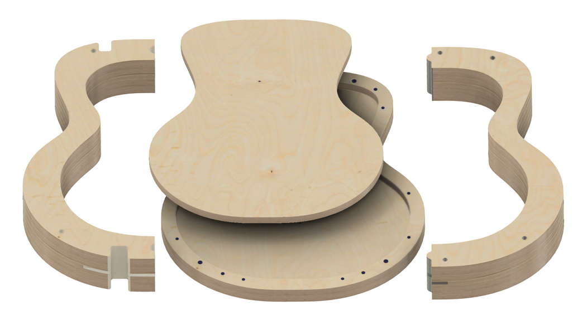
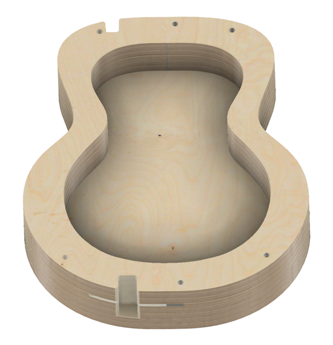
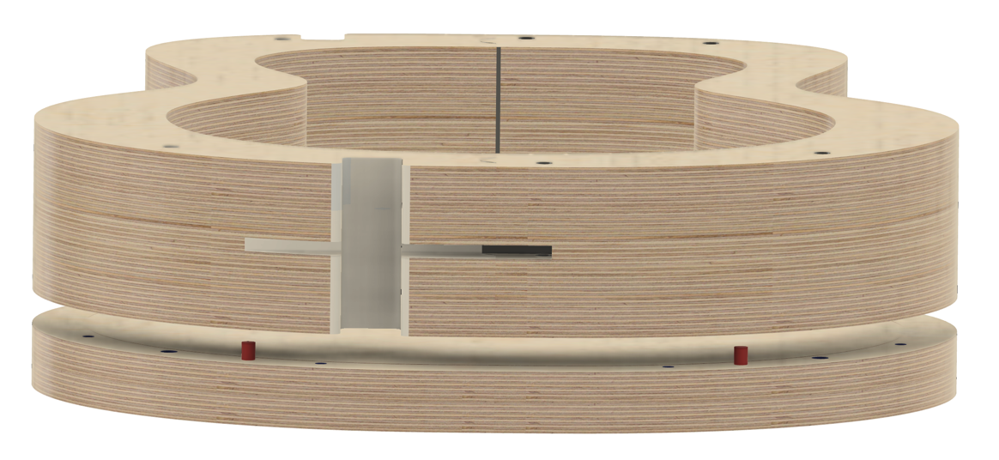
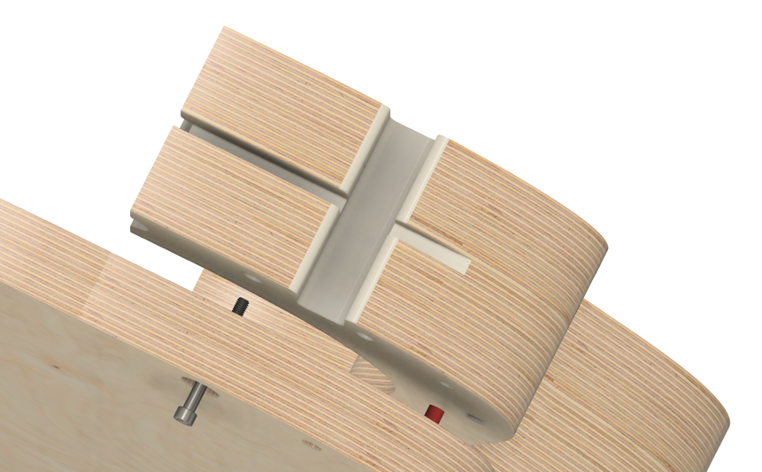
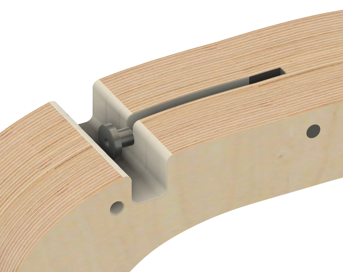
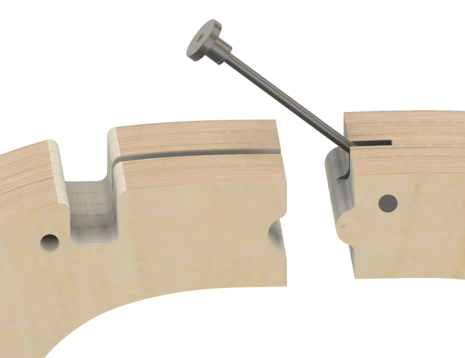
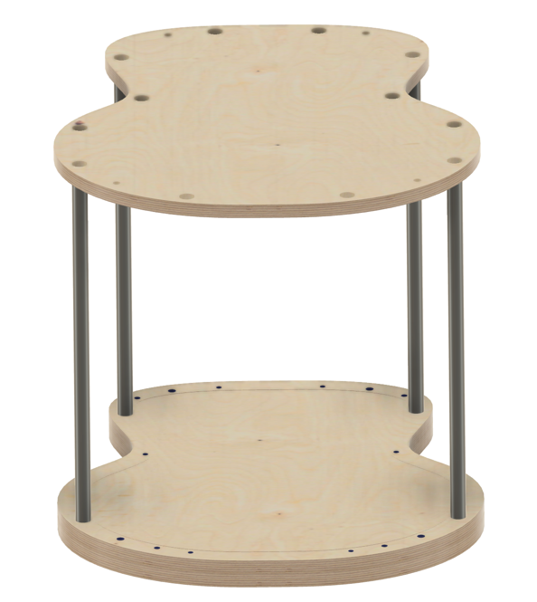

Wer sich näher mit dem Thema Gitarrenbau auseindersetzt, wird feststellen, dass (Bau)Formen und Schablonen 
ein wichtiger Schlüssel zum erfolgreichen Bau einer Gitarre sind. Vor allem beim Zusammenleimen von Zargen, Boden, Decke und Hals
sind Formen (auch "Jigs" genannt) sehr wichtig, um einen rechtwinkligen und passgenauen Zusammenbau der einzelnen Teile zu gewährleisten.

Im Gegensatz zu vielen anderen Gitarrenbausätzen im Internet bekommst du bei unserem Bausatz alle notwendigen Formen für
den Bau deiner Gitarre von uns geliehen. Im Moment arbeiten wir am Design dieser Bauformen und wollen mit euch erste 
Skizzen aus dem CAD Programm teilen.

Die Form wird aus mehreren Teilen bestehen:

* einer Grundplatte
* einer Austauschbaren Einlagen für unterschiedliche Korpusformen
* teilbaren Seitenteilen

Für den Baus des Gitarrenkorpus wird die zusammengebaute Form dann etwa so aussehen:

Die Seitenteile werden mithilfe von Arretierunsstiften an der Grundform ausgerichtet um einen passgenauen Zusammenbau zu ermöglichen:

Grundform und Seitenteile werden mit Schrauben zusammengehalten:

Die Seitenteile können über eine Verschraubung arretiert werden und in zwei Teile zerlegt werden:

Darüberhinaus können die Seitenteile von der Grundplatte entfernt werden und mit 4 Distanzhülsen und Gewindestangen ein "Leimregal" 
(im Englischen auch "Go Bar" genannt) gebaut werden, in dem die Boden- und Deckenbalken aufgeleimt werden können:

Bis die ersten Prototypen für die Bauform verfügbar sind, wird es noch eine Weile dauern. Derzeit warten wir noch auf letzte 
Teile für unsere CNC Fräse, mit der wir die Formen herstellen wollen. Darüber werden wir euch hier auf dem Laufenden halten. 
Wir freuen uns aber jetzt schon über Feedback und eure Gedanken zu den Formen - falls ihr Anregungen und Ideen habt,
immer her damit!
