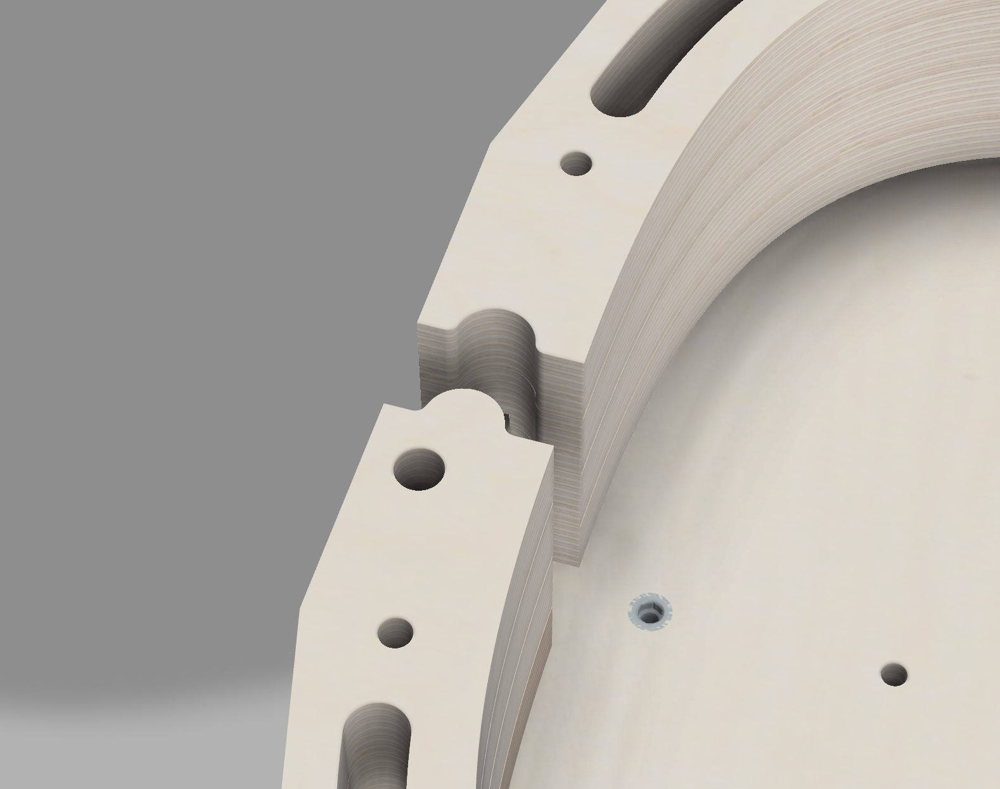

## Grundidee

Die Bauform besteht im Wesentlichen aus 4 Teilen:

* Einer Grundplatte mit austauschbaren Deckenwölbungen
* Zwei Zargenformen
* Einer Unterlage für den Hals - mit verstellbarem Halswinkel
* Einem Ständer unter der Form

Die einzelnen Teile werden mit Inbusschrauben verbunden und durch Dübel arretiert.

## Grundplatte

Die Grundplatte dient zum Aufleimen der Deckenbalken und zum Verleimen der Decke mit den Zargen:

Damit die Decke immer an der richtigen Stelle ist, wird die Decke über Dübel in der richtigen Position gehalten:

In die Grundplatte können unterschiedliche Deckenformen eingelegt werden, damit können Gitarren mit unterschiedlicher Deckenwölbung gebaut werden:

Die Deckenform wird dabei über eingelassene Gewindebuchsen mit der Grundplatte verschraubt:

Aussparungen am Rand der Grundplatte machen die Form leichter:

## Zargenkranz

Der Zargenkranz ist teilbar in zwei Hälften und wird durch Schrauben und Dübel in der richtigen Position gehalten:

Durch Zentrierfräsungen werden die Hälften des Zargenkranzes immer exakt zusammengehalten:

Die Verschraubung der beiden Hälften erfolgt "verdeckt", so dass an allen Stellen Schraubzwingen angebracht werden können:

Die Aussenseite des Zargenkranzes folgt nicht der runden Kontur der Zargen sondern besteht aus tangentialen Flächen, um das Anbringen von Zwingen zu erleichtern:

An der Unterseite des Zargenkranzes erlaubt eine Aussparung dass die Decke überstehen kann:

Auf der Hals-Seite kann die Bauform über den Hals hinweg verschraubt werden:

Aussparungen am Rand des Zargenkranzes machen die Form leichter:

## Halsunterlage

Die Halsunterlage kann an die Grundplatte angeschraubt werden. Durch die Längsplatte des Ständers kann der Halswinkel an verschiedene Deckenwölbungen angepasst werden:

Der Hals wird durch Dübel auf der Bauform arretiert und sicher an der richtigen Position gehalten:

